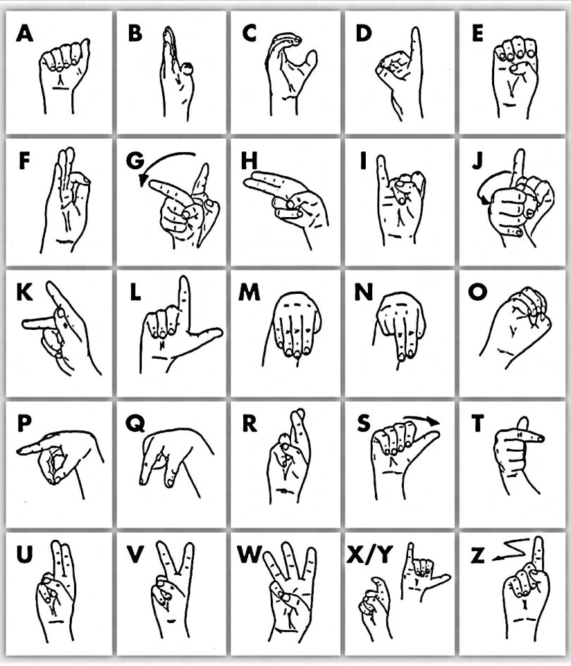

# LIS: an open-cv project
Italian Sign Language or LIS (Lingua dei Segni Italiana) is the visual language used by deaf people in Italy. Deep analysis of it began in the 1980s, along the lines of William Stokoe's research on American Sign Language in the 1960s. Until the beginning of the 21st century, most studies of Italian Sign Language dealt with its phonology and vocabulary. According to the European Union for the Deaf, the majority of the 60,000–90,000 Deaf people in Italy use LIS [Wikipedia].

The aim of the project is to create a ML model that will be able to detect the right hand, extract the main features and predict the relative sign as a function of the shape. In this project a single frame will be used for the prediction. As a consequence the 'g', 's' and 'z' (not static signs in LIS) letters are not present in the training dataset. A picture of the LIS alphabet is reported in Figure 1.

<br>
<p align="center">
  
  <figcaption align = "center">Figure 1: LIS alphabet [[1](https://dizionarioinlis.wordpress.com)].</figcaption>
</p>
<br>

# How to
## 1. Python version
These programs are written to work with Python 3.8.4.

## 2. Libraries and packages
Use the file ``requirements.txt`` to install all the dependencies. In order to do that use the commmand:

```shell
$ virtualenv --python=python3.8 venv
$ source venv/bin/activate
$ pip install -r requirements.txt
```

## 3. Mediapipe
Mediapipe offers open a customizable ML solutions for live and streaming media [[2](https://mediapipe.dev)]. MediaPipe offers ready-to-use yet customizable Python solutions as a prebuilt Python package. MediaPipe Python package is available on PyPI for Linux, macOS and Windows.This project is focused on:

* Face detection;
* Hands detection;
* Pose detection.

These three kind of detection can be tested running the file ```PoseDetection.py```. This program can be execute with the command:

```shell
$ python PoseDetection.py
```

The webcam will be able to detect the right/left hand, the face and the pose of the person. Figure 2 shows an example of the detection obtained.

<br>
<p align="center">
  
  <figcaption align = "center">Figure 2: Everything detected.</figcaption>
</p>
<p align="center">
  
  <figcaption align = "center">Figure 2: Hands not detected.</figcaption>
</p>
<br>

## 4. Data Collection
In order to create the dataset for training models an automatic procedure for data collection has been developed. Since all the positions of the letters of the alphabet are static only the right hand features will be collected. In Mediapipe a right hand is descibed by 21 points. Each point has 3 coordinates (x, y and z). As a consequence, a total of 63 features will be recorded in a CSV file. 

The samples number for each class and the output name of the CSV file are defined by user in the command line (NOT IMPLEMENTED).
```
$ python rh_dataset_collection.py -s <samples_for_each_class>
```

## 5. Models Training

## 6. Real time prediction

# Bibliography
[1] [https://dizionarioinlis.wordpress.com](https://dizionarioinlis.wordpress.com)

[2] [https://mediapipe.dev](https://mediapipe.dev)

[3] [bla bla](bla bla)
