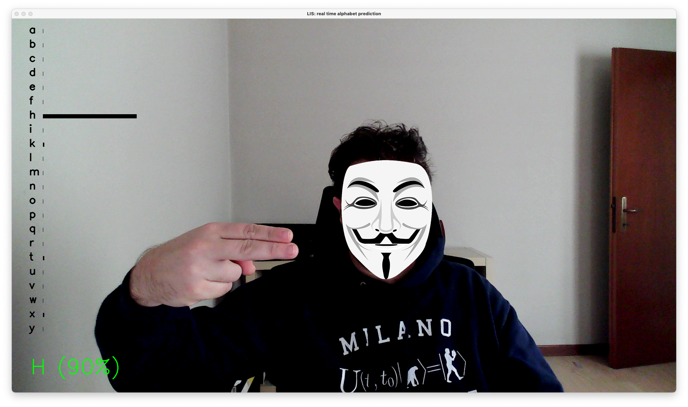

# LIS
Italian Sign Language or LIS (Lingua dei Segni Italiana) is the visual language used by deaf people in Italy. Deep analysis of it began in the 1980s, along the lines of William Stokoe's research on American Sign Language in the 1960s. Until the beginning of the 21st century, most studies of Italian Sign Language dealt with its phonology and vocabulary. According to the European Union for the Deaf, the majority of the 60,000–90,000 Deaf people in Italy use LIS [Wikipedia].

The aim of the project is to create a ML model that will be able to detect the right hand, extract the main features and predict the relative sign as a function of the shape. In this project a single frame will be used for the prediction. As a consequence the 'g', 's' and 'z' (not static signs in LIS) letters are not present in the training dataset. A picture of the LIS alphabet is reported in Figure 1.

<br>
<p align="center">
  
  <figcaption align = "center">Figure 1: LIS alphabet [[1](https://dizionarioinlis.wordpress.com)].</figcaption>
</p>
<br>

# How to
## 1. Python version
These programs are written to work with Python 3.8.4.

## 2. Libraries and packages
Use the file ``requirements.txt`` to install all the dependencies. In order to do that use the commmand:

```shell
$ virtualenv --python=python3.8 venv
$ source venv/bin/activate
$ pip install -r requirements.txt
```

Structure of the project is:

```shell
Python-LIS/
	|__ data/
		|__ data_rh_test.csv
		|__ data_rh_all.csv	
	|__ models/
		|__ model_svm_test.sav
		|__ model_svm_all.sav
	|__ images/
		|__ alfabeto_LIS.jpg
		|__ hand_detected.png
		|__ hand_not_detected.png
	|__ jupyter/
		|__ LIS.ipynb
		|__ LIS_rh.ipynb
		|__ Untitled.ipynb
		|__ letter_H.png
		|__ letter_Y.png
		|__ letter_V.png
	|__ venv/
	|__ README.md
	|__ requirements.txt
	|__ LICENSE
	|__ utils.py
	|__ pose_detection.py
	|__ rh_dataset_collection.py
	|__ train_svm.py
	|__ real_time_prediction.py
```

## 3. Mediapipe
Mediapipe offers open a customizable ML solutions for live and streaming media [[2](https://mediapipe.dev)]. MediaPipe offers ready-to-use yet customizable Python solutions as a prebuilt Python package. MediaPipe Python package is available on PyPI for Linux, macOS and Windows. This project is focused on:

* Face detection;
* Hands detection;
* Pose detection.

These three kind of detection can be tested running the file ```pose_detection.py```. This program can be execute with the command:

```shell
$ python pose_detection.py
```

The webcam will be able to detect the right/left hand, the face and the pose of the person. Figure 2 shows an example of the detection obtained.

<br>
<p align="center">
  
  <figcaption align = "center">Figure 2: Everything detected.</figcaption>
</p>
<p align="center">
  
  <figcaption align = "center">Figure 2: Hands not detected.</figcaption>
</p>
<br>

## 4. Data Collection
In order to create a dataset for training models, an automatic procedure for data collection has been developed (```rh_dataset_collection.py ```). Since all the positions of the letters of the LIS alphabet can be reproduced using one hand only the right hand features will be collected. In Mediapipe a right hand is descibed by 21 points. Each point has 3 coordinates (x, y and z). As a consequence, a total of 63 features will be recorded in a CSV file. 

The samples number of each class, the minimum confidence for detection/tracking required and the output name of the CSV file can be defined by user in the command line.

```shell
$ python rh_dataset_collection.py -h

usage: rh_dataset_collection.py [-h] [-s SAMPLE] [-dc MIN_DETECTION_CONFIDENCE]
                                [-tc MIN_TRACKING_CONFIDENCE] [-o OUTPUT_FILE]

optional arguments:
  -h, --help            show this help message and exit
  -s SAMPLE, --sample SAMPLE
                        number of samples for each letter. default value is 100
  -dc MIN_DETECTION_CONFIDENCE, --det_conf MIN_DETECTION_CONFIDENCE
                        Threshold for prediction. A number between 0 and 1. default is 0.5
  -tc MIN_TRACKING_CONFIDENCE, --trk_conf MIN_TRACKING_CONFIDENCE
                        Threshold for prediction. A number between 0 and 1. default is 0.5
  -o OUTPUT_FILE, --output OUTPUT_FILE
                        Name of the saved model. default is 'data_rh'
```

The CSV file will be saved in the ```data/``` folder.

## 5. Model Training
```train_svm.py``` allows to train a SVM (Support Vector Machine) algorithm [3]. With several optional parameters it is possible to specify the training dataset, how to split in train and test and the name of the final model.

```shell
$ python train_svm.py -h

usage: train_svm.py [-h] [-i FILENAME] [-t TEST_SIZE] [-o OUTPUT_FILE]

optional arguments:
  -h, --help            show this help message and exit
  -i FILENAME, --file FILENAME
                        PATH of training FILE
  -t TEST_SIZE, --test TEST_SIZE
                        Test size. A number between 0 and 1. default value is 0.3
  -o OUTPUT_FILE, --output OUTPUT_FILE
                        Name of the saved model. Default value is "model_svm". 
                        The model will be saved in the 'models' folder with .sav extension
```

The model will be saved in the ```models/``` folder.

## 6. Real time prediction
In order to test the model in real time use the ```real_time_prediction.py``` file. Optional parameters allow to specify the ML model and the prediction/detection/tracking confidences.

```shell
$ python real_time_prediction.py -h

usage: real_time_prediction.py [-h] [-m FILE] [-t THRESHOLD_PREDICTION] [-dc MIN_DETECTION_CONFIDENCE] [-tc MIN_TRACKING_CONFIDENCE]

optional arguments:
  -h, --help            show this help message and exit
  -m FILE, --model FILE
                        PATH of model FILE.
  -t THRESHOLD_PREDICTION, --threshold THRESHOLD_PREDICTION
                        Threshold for prediction. A number between 0 and 1. default is 0.5
  -dc MIN_DETECTION_CONFIDENCE, --det_conf MIN_DETECTION_CONFIDENCE
                        Threshold for prediction. A number between 0 and 1. default is 0.5
  -tc MIN_TRACKING_CONFIDENCE, --trk_conf MIN_TRACKING_CONFIDENCE
                        Threshold for prediction. A number between 0 and 1. default is 0.5
```

<br>
<p align="center">
  
  
  
  <figcaption align = "center">Figure 4: Real time prediction of letters V, H and Y</figcaption>
</p>
<br>

# Bibliography
[1] [https://dizionarioinlis.wordpress.com](https://dizionarioinlis.wordpress.com)

[2] [https://mediapipe.dev](https://mediapipe.dev)

[3] [https://scikit-learn.org/stable/modules/svm.html#classification](https://scikit-learn.org/stable/modules/svm.html#classification)

[4] [...](...)
